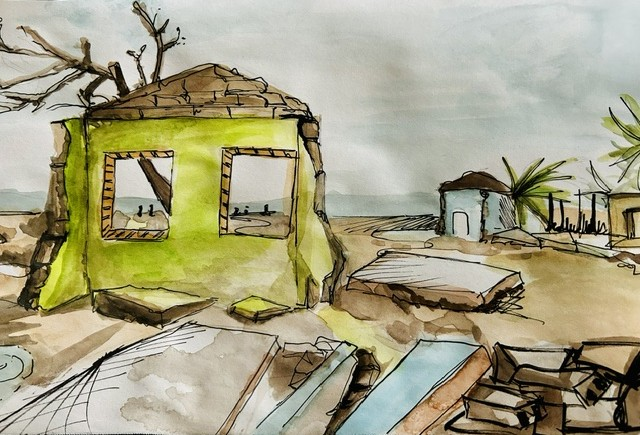

```{r setup, include=FALSE}
# Load required libraries for the report
library(tidyverse)
library(janitor)
library(patchwork)
library(gt)
library(showtext)
library(ragg)
library(ggrepel)
library(ggthemes)
library(gghighlight)
library(ggdist)
library(beeswarm)
library(png)
library(ggtext)
library(stringr)
library(grid)
library(skimr)

# Load Google fonts
font_add_google("Love Ya Like A Sister", "sister")
font_add_google("Montserrat", "montserrat")
font_add_google("Roboto", "roboto")
font_add_google("Gloria Hallelujah", "gloria")
font_add_google("Indie Flower", "indie")
font_add_google("Jost", "jost")
font_add_google("Ubuntu", "ubuntu")

# Automatically use showtext to render text
showtext_auto()

# Load the cleaned data files
pcf_population <- readRDS("./data/pcf_pop_clean.rds")
pcf_dis_affected <- readRDS("./data/pcf_dis_affected_clean.rds")
pcf_dis_economic <- readRDS("./data/pcf_dis_economic_clean.rds")
pcf_sea_anomalies <- readRDS("./data/pcf_sea_temp_anomalies_clean.rds")

# Common theme for all plots
# Optimized for web legibility and wider display
common_theme <- theme_minimal(base_family = "jost") +
  theme(
    plot.title = element_text(face = "bold", size = rel(2.5), color = "#FF6B6B"),
    plot.subtitle = element_text(family = "roboto", size = rel(1.6), color = "gray40",
                                lineheight = 1.2, margin = margin(t = 6, b = 15)),
    plot.caption = element_text(color = "grey40", size = rel(1.2)),
    axis.title.x = element_text(hjust = 0, color = "gray40", size = rel(1.4)),
    axis.title.y = element_text(hjust = -0.5, vjust = 3, color = "gray40", size = rel(1.4)),
    axis.text.y = element_text(color = "gray40", size = rel(1.2)),
    axis.text.x = element_text(color = "gray40", size = rel(1.2)),
    legend.title = element_text(color = "gray40", size = rel(1.2), hjust = 0.5),
    legend.text = element_text(color = "gray40", hjust = 0.5, margin = margin(t = 4), size = rel(1.0)),
    plot.tag = element_text(size = rel(1.4)),
    plot.margin = margin(1.5, 1.5, 1.5, 1.5, unit = "cm"),
    panel.background = element_rect(fill = "white", color = NA)
  )
```

On March 13th 2015, an ominous sensation swept over the shores of Port Vila. Hotels, schools and roads were deserted. More than 2000 people were sheltering in evacuation centres. Disaster was on the horizon.

That evening, just before midnight, **Pam**, a category five cyclone, struck Vanuatu’s capital with extremely destructive force. Winds reaching 250kmph ripped off metal roofs from houses and schools; communications and power infrastructure were destroyed or heavily damaged; crops were wiped out and food stocks blown into debris. The devastation was unprecedented, affecting 188,000 people (over half the population), with up to 90% of buildings damaged or destroyed. Total estimated economic losses reached \$449 million (roughly 64% of Vanuatu’s GDP).

{fig-alt="Cyclone Pam Aftermath" width="80%"}

By and large, the Pacific Region is one of the most vulnerable regions in the world. Perennial friction between the Australian and Pacific tectonic plates trigger earthquakes and volcanic activity; sometimes resulting in massive tsunamis. Shifts in ocean currents and weather patterns such as El Niño generate cyclones and droughts. For people living in this vast region, such natural disasters are nothing new.

**What has changed?**

Statistics from the Pacific Data Hub show that, during the last decade, disasters affecting large proportions of the population across **Melanesia** and **Micronesia** have become more frequent. Tuvalu and Tonga in Polynesia reflect this new pattern too. The arrival of Cyclone Pam in 2015 seemed to mark the beginning of a new era of more frequent and devastating disasters. This trend poses a growing challenge, as regional economies struggle to rebuild and recover .

Only a year after Pam’s tragic appearance, **Winston** emerged. Back then, the fiercest tropical storm ever recorded in the Southern Hemisphere. Its trajectory was unusual; it followed a big counter-clockwise loop to the east of Fiji that amplified its strength, before striking Viti Levu, Fiji’s largest island. The human and economic toll were catastrophic: more than half a million people were affected and economic losses reached 10% of GDP.

```{r fig1-pacific-disasters, echo=FALSE, warning=FALSE, message=FALSE, fig.pos='H', class.source="full-width"}
# Affected Persons by Disasters, Pacific Data Hub dataset
p1 <- ggplot(pcf_dis_affected, aes(x = Year, y = Country)) +
  geom_vline(
    xintercept = 2015,
    linewidth = 0.6,
    linetype = "longdash",
    color = "palevioletred1"
  ) +
  geom_point(data = filter(pcf_dis_affected, Affected_Pop_Perc < 0.24),
             aes(size = Affected_Persons),
             color = "seashell2") +
  geom_point(data = filter(pcf_dis_affected, Affected_Pop_Perc >= 0.24),
             aes(size = Affected_Persons),
             color = "#4ECDC4",
             alpha = 0.6) +
  geom_text(
    data = filter(pcf_dis_affected, Affected_Pop_Perc > 0.24),
    aes(label = paste0(round(Affected_Persons / 1000, 0), "k")),
    color = "#0077BE",
    family = "ubuntu",
    fontface = "bold",
    size = rel(6)
  ) +
  scale_size(range = c(1, 15), labels = function(x) paste0(round(x / 1000, 1), "k")) +
  facet_wrap(~Region, ncol = 1, scales = "free_y") +
  labs(
    title = "Pacific Disasters: A New Era",
    subtitle = "Since 2015, most Pacific countries have experienced at least one disaster affecting 25% or more of their population (highlighted).",
    caption = "Source: Pacific Data Hub",
    x = "",
    y = "",
    tag = "Fig.1",
    size = "Affected Persons"
  ) +
  common_theme +
  theme(
    legend.position = "bottom",
    strip.text = element_text(family = "jost", size = rel(4), color = "gray50"),
    strip.background = element_rect(fill = "snow2", color = "white", linewidth = 0.5),
    plot.margin = margin(0.8, 0.8, 0.8, 0, unit = "cm")
  )

print(p1)
```

```{r fig2-economic-damage, echo=FALSE, warning=FALSE, message=FALSE, fig.pos='H', class.source="full-width"}
# Economic Losses, Pacific Data Hub
pcf_dis_economic_vu <- pcf_dis_economic %>% filter(Country == "Vanuatu")

new_records_vu <- data.frame(
  Year = c(2013, 2016, 2017, 2019, 2020),
  Region = "Melanesia",
  Pacific_Island = "VU",
  Country = "Vanuatu",
  Economic_Loss = 0,
  Pop_millions = 0.27
)

pcf_dis_economic_vu <- bind_rows(pcf_dis_economic_vu, new_records_vu)

ec_p1 <- ggplot(pcf_dis_economic_vu, aes(x = Year, y = Economic_Loss)) +
  geom_line(
    linewidth = 1.2,
    color = "#0077BE",
    lineend = "round",
    linejoin = "round"
  ) +
  geom_area(
    fill = "#4ECDC4",
    alpha = 0.5,
    lineend = "round",
    linejoin = "round"
  ) +
  geom_point(
    size = 2,
    color = "#0077BE",
    stroke = 1
  ) +
  annotate(
    geom = "text",
    x = 2015,
    y = 460000000,
    label = "Cyclone Pam:\nEconomic losses reached\n  ~$450m (64% of GDP)",
    hjust = -0.15, vjust = 1,
    fontface = "bold",
    family = "roboto",
    color = "#0077BE",
    size = 18
  ) +
  scale_x_continuous(breaks = unique(pcf_dis_economic_vu$Year), labels = as.integer) +
  scale_y_continuous(
    labels = function(x) paste0("$", round(x / 1000000, 1), "m"),
    expand = expansion(mult = c(0, 0.25))
  ) +
  facet_wrap(~Country, ncol = 1, scales = "free_y") +
  labs(
    title = "Unprecedented Economic Damage",
    subtitle = "The damage to food stocks and critical infrastructure (schools, clinics, homes, power stations) has reached new heights. In March 2015, Category 5 Cyclone Pam left Vanuatu's population vulnerable to food shortages. Just a year later, in February 2016, Cyclone Winston - one of the fiercest storms ever recorded, left a similar trail of destruction across Fiji, striking homes and vital tourism infrastructure.",
    caption = "Source: Pacific Data Hub",
    x = "",
    y = "Economic Loss USD",
    tag = "Fig. 2"
  ) +
  common_theme +
  theme(
    strip.text = element_text(family = "jost", size = rel(1.2), color = "gray50"),
    strip.background = element_rect(fill = "snow2", color = "white", linewidth = 0.5),
    axis.text.x = element_blank(),
    panel.grid.minor = element_blank(),
    plot.margin = margin(0.8, 0.8, 0, 0.8, unit = "cm")
  )

# Fiji plot
pcf_dis_economic_fj <- pcf_dis_economic %>% filter(Country == "Fiji")

new_records_fj <- data.frame(
  Year = c(2013, 2014, 2015, 2017),
  Region = "Melanesia",
  Pacific_Island = "FJ",
  Country = "Fiji",
  Economic_Loss = 0,
  Pop_millions = 0.92
)

pcf_dis_economic_fj <- bind_rows(pcf_dis_economic_fj, new_records_fj)

ec_p2 <- ggplot(pcf_dis_economic_fj, aes(x = Year, y = Economic_Loss)) +
  geom_line(
    linewidth = 1.2,
    color = "#0077BE",
    lineend = "round",
    linejoin = "round"
  ) +
  geom_area(
    fill = "#4ECDC4",
    alpha = 0.5,
    lineend = "round",
    linejoin = "round"
  ) +
  geom_point(
    size = 2,
    color = "#0077BE",
    stroke = 1
  ) +
  annotate(
    geom = "text",
    x = 2016,
    y = 400000000,
    label = "Cyclone Winston:\nEconomic losses reached\n  ~$400m (10% of GDP)",
    hjust = -0.15, vjust = 1,
    fontface = "bold",
    family = "roboto",
    color = "#0077BE",
    size = 18
  ) +
  scale_x_continuous(breaks = unique(pcf_dis_economic_vu$Year), labels = as.integer) +
  scale_y_continuous(
    labels = function(x) paste0("$", round(x / 1000000, 1), "m"),
    expand = expansion(mult = c(0, 0.25))
  ) +
  facet_wrap(~Country, ncol = 1, scales = "free_y") +
  labs(
    x = "",
    y = ""
  ) +
  theme_minimal() +
  common_theme +
  theme(
    strip.text = element_text(family = "jost", size = rel(1.2), color = "gray50"),
    strip.background = element_rect(fill = "snow2", color = "white", linewidth = 0.5),
    panel.grid.minor = element_blank()
  )

# Stack plots vertically
ec_stacked_plot <- (ec_p1 / ec_p2) + plot_layout(heights = c(4, 4), width = 1)
print(ec_stacked_plot)
```

According to experts, “exceptionally warm” ocean temperatures above average, driven by El Niño and climate change, allowed Winston to intensify quickly and maintain its Category 5-level strength.

People in the Pacific are familiar with El Niño - a recurring climate pattern driven by shifts in the winds above the eastern Pacific. It brings heavy rains, droughts and heatwaves; its broad effects ripple across the globe. The strength of any particular El Niño is measured by how much sea temperatures rise above average. The 2015-2016 edition was exceptional; nurturing strong tropical storms such as Winston. Over time, Pacific island countries have adapted to its impacts.

However, the data reveals another important milestone reached in 2015. For years, sea temperatures in the South Pacific have been rising steadily due to climate change and a warming planet. But in 2015, near the island of Kiribati, the first temperature anomaly \> 1°C was recorded. Since then, four more anomalies have hit that threshold.

Although climate change and El Niño are not associated with each other, they amplify each other’s effects. The upshot for people living in the South Pacific is warmer sea temperatures and a greater risk of cyclones like Pam and Winston; high-impact disasters that can upend the lives of so many people and bring unprecedented damage on the economies that sustain them.

```{r fig3-hot-water, echo=FALSE, warning=FALSE, message=FALSE, fig.pos='H', class.source="full-width"}
# Recreate Fig.3 from pacific_data_viz.R
max_temp <- pcf_sea_anomalies %>% pull(Temp) %>% max(na.rm = TRUE)
min_temp <- pcf_sea_anomalies %>% pull(Temp) %>% min(na.rm = TRUE)

# Filter rows where Temp matches max or min
countries_high_temp <- pcf_sea_anomalies %>% filter(Temp > 1) %>% select(Year, Country, Temp)

ps1 <- ggplot(pcf_sea_anomalies, aes(x = Year, y = Temp)) +
  geom_jitter(aes(color = ifelse(Temp > 1, "#4ECDC4", "#FF6B6B")),
              width = 0.3, height = 0.1, alpha = 0.7, show.legend = FALSE) +
  geom_smooth(method = "lm", formula = "y ~ x", se = TRUE, linewidth = 0.8, color = "gray20") +
  geom_hline(yintercept = 0, linetype = "solid", color = "#0077BE", linewidth = 1, alpha = 0.6) +
  annotate(
    "text",
    x = 2022,
    y = 0,
    label = "1971–2000 climatological baseline",
    vjust = 1.5,
    hjust = 1.1,
    family = "jost", color = "#0077BE", size = 20, fontface = "bold"
  ) +
  annotate(
    geom = "text",
    x = 2015, y = 1.1, label = "Kiribati",
    hjust = -0.25, vjust = 1,
    fontface = "bold",
    family = "roboto", color = "#FF6B6B", size = 14
  ) +
  annotate(
    geom = "text",
    x = 2015, y = -1.1,
    label = "Each dot represents the average annual temperature anomaly in a Pacific Island Country.",
    hjust = 0.5,
    family = "roboto", color = "gray40", size = 6, fontface = "italic"
  ) +
  scale_y_continuous(limits = c(-1.25, 1.25)) +
  labs(
    title = "Hot Water",
    subtitle = "The heat, like the damage, keeps climbing. Sea temperature anomalies in the South Pacific have followed an upward trend for two decades. The first anomaly > 1 °C was recorded in 2015 near the island of Kiribati.",
    caption = "Source: Pacific Data Hub",
    x = "",
    y = "Sea temperature anomaly (°C)",
    tag = "Fig. 3"
  ) +
  common_theme +
  theme(
    axis.title.y = element_text(hjust = 0.5),
    plot.margin = margin(0.8, 0.8, 0, 0.8, unit = "cm")
  )

# Format the table using gt()
high_temp_table <- gt(countries_high_temp) %>%
  cols_align(align = "center") %>%
  cols_width(
    Year ~ px(80),
    Country ~ px(150),
    Temp ~ px(80)
  ) %>%
  tab_header(title = "Temp. Anomalies > 1°C") %>%
  tab_style(
    style = cell_text(
      font = "jost",
      size = px(12),
      color = "gray58",
      weight = "bold"
    ),
    locations = cells_body()
  ) %>%
  tab_style(
    style = cell_text(
      font = "jost",
      size = px(14),
      color = "gray58",
      weight = "bold"
    ),
    locations = cells_column_labels()
  ) %>%
  tab_style(
    style = cell_text(
      font = "jost",
      size = px(16),
      color = "#FF6B6B",
      weight = "bold"
    ),
    locations = cells_title()
  )

# Print the plot
print(ps1)

# Print the table separately
high_temp_table
```

The message is clear: **climate change is the single greatest threat to the livelihoods, security and well-being of the peoples of the Pacific**. How can the Pacific South prepare for this new era?

------------------------------------------------------------------------

*Report prepared for Pacific Data Viz Challenge 2026*\
*Data analysis and visualizations: Juan J. Ortiz*\
*Source data: Pacific Data Hub, United Nations, World Bank*
